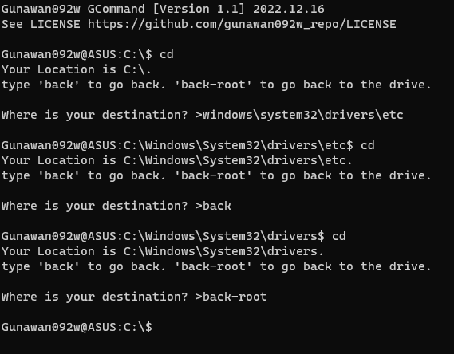

<!-- Inspired by: MiguVT@github -->
# Hi, welcome to my profile!

---

## About me!
I'm archcloudy, a catboy person who loves to tinker with tech stuff. Currently focusing to learn **frontend/backend**. 
Lives in **Indonesia** and pretty socially awkward..

I'm into Net/SysAdmin, currently learning Python 
My main stack is: Javascript/nodeJS, Python, HTML/CSS [beware, very noob!]

I primarily use VSCodium as code editor :3

---

## Journey
- 2019 - Learning NodeJS/Javascript and creating my first Discord bot (discordJS v12) on my Windows 8.1 with notepad++ haha
- 2021 - Learned basics of HTML, can see here on [archive.org-1](https://web.archive.org/web/20210000000000*/gunawan092w.rf.gd), [archive.org-2](https://web.archive.org/web/20230419060126/http://gunawan092w.tk/), and [archive.org-3](https://web.archive.org/web/20230522115204/https://gunawan092w.us.to/).  [Source Backups (2021-2022) here](https://github.com/archcloudy/gunawan092w-web)
- 2021 - Started making random stuff out of batch file lmfaoooo

## Projects
### GitHub Projects (2022-2026) [JS|PHP]
- [discord-webclient-2019](https://github.com/archcloudy/discord-webclient-2019) - no description (August 2022)
- [cvmBotJS](https://github.com/archcloudy/cvmbotJS) - a [collabVM](https://computernewb.com/collab-vm) bot based on JavaScript (Feb 2024 - Apr 2025)
- [NoteTop Music](https://github.com/archcloudy/notetop-music) - Discord Music bot based on erela.js and LavaLink v3 (Mar 2024 - Apr 2024)
- [discord-webclient](https://github.com/archcloudy/discord-webclient) - Selfhostable discord client proxy (May 2024 - Jun 2025)
- [classicubeWeb](https://github.com/archcloudy/classicube-web) - a simple classicube web made in PHP (Dec 2024)
- [CloudAI](https://github.com/archcloudy/cloudai) - A Discord AI Bot powered by Google Gemini (Jun 2025 / active)
- [WishCord](https://github.com/archcloudy/wishcord/) - Discord API ReImplementation - vibecoded (Apr 2026 - May 2026)
### Batch file (.bat) (2021-2022)
Unfortunately, they're considered lost media. 
- gcommand - a command prompt simulator (2022) 

    
 Screenshot

    

 

- mc-nogui - Minecraft launcher based on batch file 
 

    
Versions

    There are two versions of this. 
    A. Original version that only ships minimal (most assets removed) Optifine 1.16.5;  B. WIP Version v1.3 that ships Salwyrr Client 4, Lunar Client 1.8.9/1.16.5, and BadLion Client Prod. 4. <a href="https://youtu.be/9AHQS5NNX6w">Video showcasing the WIP ver can be found here.</a>  
    Both of those projects were written <b>ALL FROM SCRATCH.</b>  It was created because:  1. i have so many dumb ideas,  2. i have nothing to do at home and IM BORED.

### Xiaomi 12T Developement
I'm a Xiaomi 12T AOSP maintainer. You can find all of the source right here: https://github.com/mt6895-plato 
ROMs that i maintain on:
- [EvolutionX](https://xdaforums.com/t/4791175/) (Last: 11.7 A16-QPR2)
- [LineageOS](https://xdaforums.com/t/4794704/) (lineageOS 23.2, Active)
- [PixelOS](https://xdaforums.com/t/4794705/) (sixteen-qpr2, Active)
- ~~AxionOS (branch: axion-23.2) (ComingSoon)~~ Someone ported it already QwQ
- [CalyxOS](https://github.com/CalyxOS-Plato) (scrapped)

---

## Self-Hosted Infrastructure
Running on **Lenovo Thinkcentre M910q** with Cloudflare Tunnel for public access. 

    
Specs (if you care)

    - CPU: Intel Core I5-6500T @ 2.50GHz 
    - RAM: 16GB 2400MHz DDR4 (Sk-Hynix/TeamGroup) 
    - Storage: 1TB HDD + 256GB SSD M.2-NVME (OS) 
    - OS: Proxmox VE

### Services that i host:
- [CasaOS](https://home.archcloudy.qzz.io) - Personal cloudOS
- [Immich](https://photos.gunawan092w1.eu.org/) - Self-hosted Google Photos lol.
- [Pterodactyl Panel](https://panel.gunawan092w1.eu.org) - Where i host my game server with playit.gg

### Future
Looking to buy small vps to host a mail server and wireguard VPN, and maybe a domain lol. 
Planning to host NextCloud on my homelab also :3

## Contact
You may contact me on telegram: @thecloudguy9 
or email: cloudguy9@proton.me

    You've reached the end of README.MD! 
    Thanks for taking your time reading little bit about me >~<

---

  

Inspired by: <b>MiguVT@GitHub</b>

<!-- Inspired by: MiguVT@github -->
